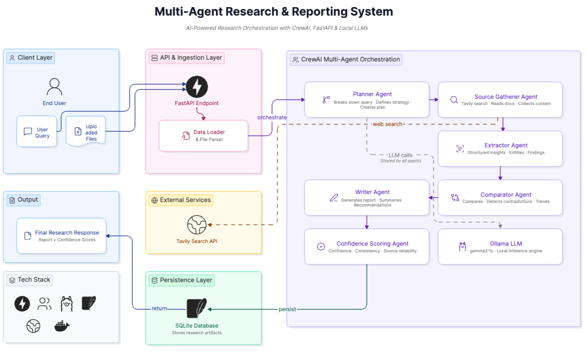

# Multi-Agent Research & Reporting System

AI-powered multi-agent research and comparative analysis system using:

- CrewAI
- Ollama
- FastAPI
- SQLite
- Tavily Search
- Multi-format document ingestion

---

# Features

- Multi-agent orchestration using CrewAI
- Local LLM support using Ollama
- Internet research using Tavily
- Comparative research across multiple uploaded documents
- Persistent SQLite storage
- Async FastAPI backend
- Swagger UI support
- Multi-file upload support

## Supported File Types

- `.html`
- `.csv`
- `.xlsx`
- `.xls`
- `.txt`
- `.pdf`

---

# System Workflow

```text
Request
   ↓
Planner Agent (Task Breakdown)
   ↓
Source Gatherer Agent
   ↓
Extractor Agent
   ↓
Comparator Agent
   ↓
Writer Agent
   ↓
Confidence Scoring Agent
   ↓
Persist Output (SQLite)
```

---

# Agent Workflow

## 1. Planner Agent

Responsible for:

- Breaking down user query
- Defining research strategy
- Creating execution plan

---

## 2. Source Gatherer Agent

Responsible for:

- Internet search using Tavily
- Collecting uploaded file data
- Gathering external context

---

## 3. Extractor Agent

Responsible for:

- Extracting structured insights
- Identifying entities and findings
- Parsing useful information

---

## 4. Comparator Agent

Responsible for:

- Comparative analysis
- Similarity detection
- Contradiction analysis
- Trend identification

---

## 5. Writer Agent

Responsible for:

- Final research report generation
- Summaries
- Conclusions
- Recommendations

---

## 6. Confidence Scoring Agent

Responsible for:

- Confidence evaluation
- Source reliability scoring
- Consistency validation

---

## Workflow Architecture

<p align="center">
  
</p>

---

# Installation

## 1. Install Ollama

Download Ollama:

```text
https://ollama.com/download/
```

---

## 2. Pull Model

```bash
ollama pull gemma3:1b
```

---

# Python Environment Setup

## Option 1 — Virtual Environment

```bash
python3.11 -m venv venv

source venv/bin/activate
```

---

## Option 2 — Conda Environment

```bash
conda create -n agentic_ai python=3.11 -y

conda activate agentic_ai
```

---

# Install Dependencies

```bash
pip install -r requirements.txt
```

---

# Run Ollama

```bash
ollama serve
```

---

# Run Application

```bash
uvicorn main:app --reload
```

```text
http://127.0.0.1:8000/docs
```

---

# Docker Setup

## Build & Run

```bash
docker-compose up --build
```

---
Application will run at:

```text
http://localhost:8000
```

---

# Swagger UI

Open:

```text
http://localhost:8000/docs
```

---

# User Input

Users can:

- Directly provide queries
- Upload multiple documents
- Perform comparative research
- Interact with their own data

## Supported Upload Formats

```text
.html
.csv
.xlsx
.xls
.txt
.pdf
```

---

# Example User Query

```text
Do comparative research between uploaded vendors
```

---

# Example API Output

```json
{
  "success": true,
  "session_id": 7,
  "query": "do the comparative research",
  "uploaded_files": [
    "source_A_vendor_brief_acmedoc_ai.html",
    "source_B_vendor_brief_papermind_ai.html",
    "source_C_pricing_features.csv",
    "source_D_internal_stakeholder_notes.txt",
    "source_E_security_questionnaire_summary.pdf"
  ],
  "result": "Final comparative research report generated by CrewAI agents..."
}
```

---

# Project Structure

```text
├── .dockerignore
├── .env
├── .env.example
├── .gitignore
├── Dockerfile
├── README.md
├── agents
│   ├── comparator_agent.py
│   ├── confidence_scoring_agent.py
│   ├── crew.py
│   ├── extractor_agent.py
│   ├── planner_agent.py
│   ├── source_agent.py
│   ├── tasks.py
│   └── writer_agent.py
├── core
│   ├── config.py
│   ├── database.py
│   ├── llm_manager.py
│   └── logger.py
├── database
│   └── research_agent.db
├── docker-compose.yml
├── logs
│   └── app.log
├── main.py
├── output
│   └── response_1780230394837.json
├── requirements.txt
├── routers
│   └── research_router.py
├── tools
│   ├── data_loader.py
│   └── tavily_search.py
└── uploads
    ├── source_A_vendor_brief_acmedoc_ai.html
    ├── source_B_vendor_brief_papermind_ai.html
    ├── source_C_pricing_features.csv
    ├── source_D_internal_stakeholder_notes.txt
    └── source_E_security_questionnaire_summary.pdf
```

---

# Technologies Used

- Python 3.11
- FastAPI
- CrewAI
- Ollama (Primary Model)
- Groq (Fallback)
- OPenAI (Default)
- SQLite
- Tavily
- Pandas
- BeautifulSoup
- PyPDF
- Docker

---

# Database Persistence

SQLite database is used for:

- Research sessions
- Uploaded file metadata
- Extracted insights
- Comparative results
- Final reports
- Confidence scores

---

# Future Improvements

- Vector Database Integration
- RAG Pipeline
- Semantic Search
- Redis Queue
- Celery Background Workers
- Streamlit Dashboard
- Authentication
- Multi-user Workspace
- Report Export (PDF/DOCX)

---

# Author

## Mohammad Seraj